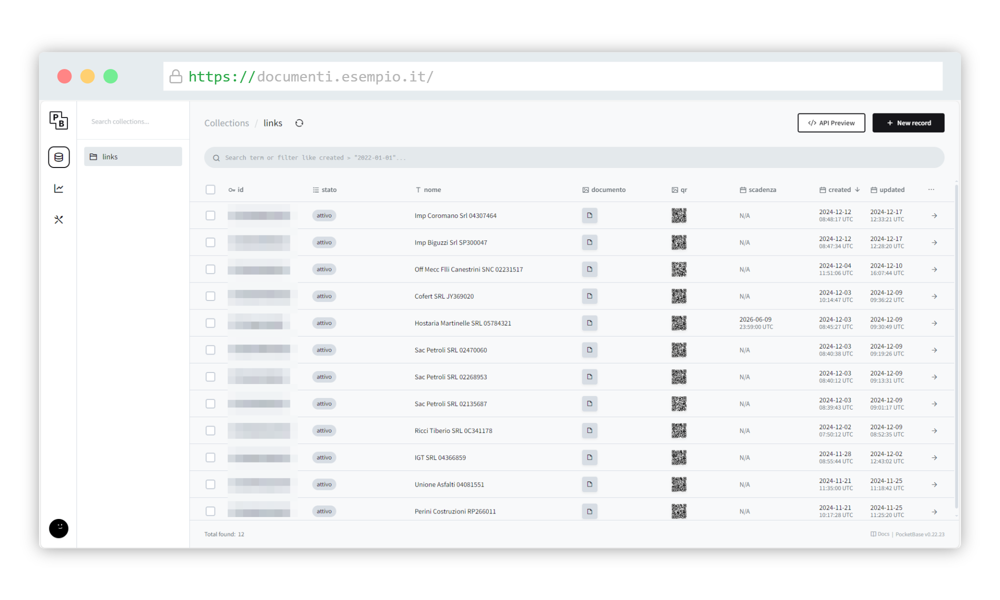
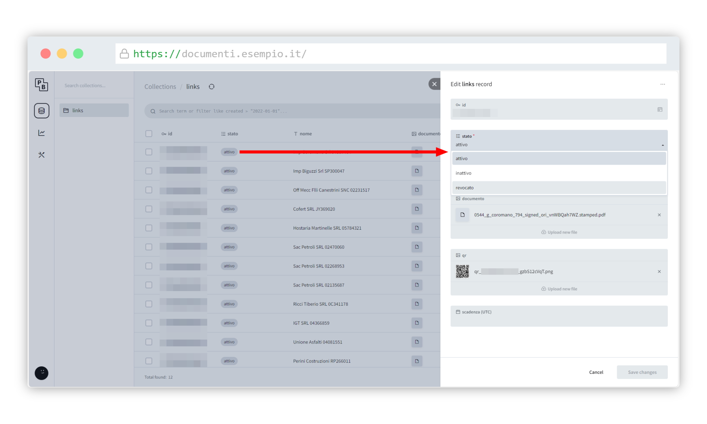
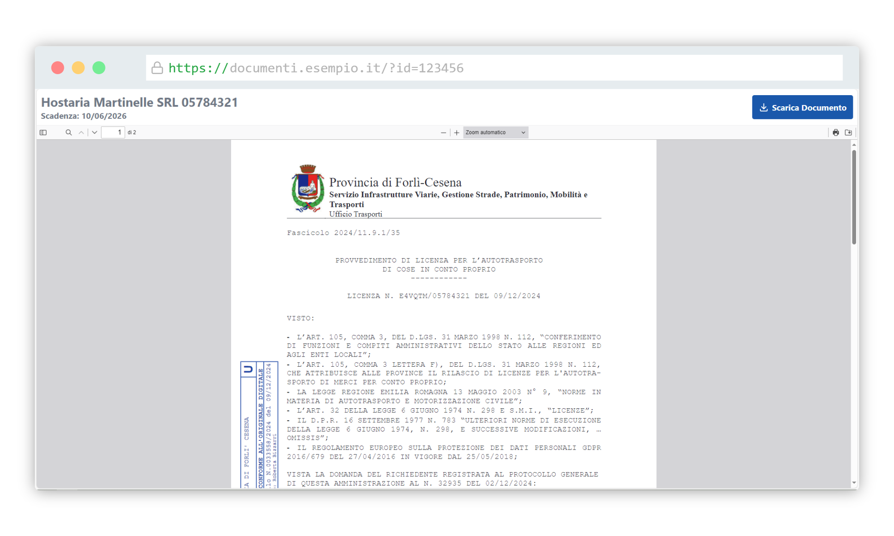
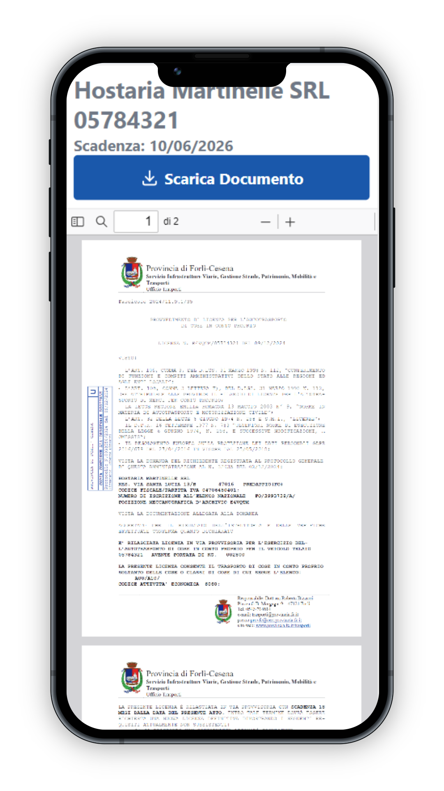
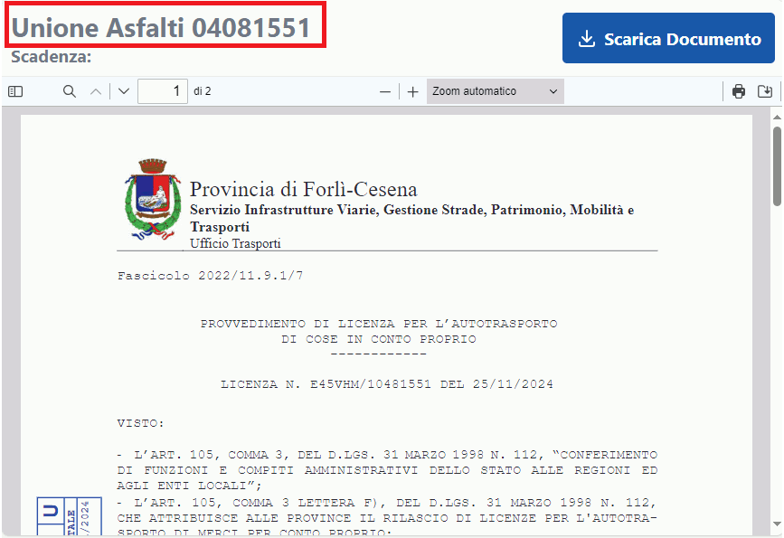

<h3 align="center">Glifo</h3>

<p align="center">
    Un'applicazione per la gestione di documenti, usando un timbro elettronico
</p>

<!-- ABOUT THE PROJECT -->
## Informazioni sul progetto

<p align="center">
   
</p>
Questo progetto utilizza Pocketbase (v0.22.23) per la gestione di documenti caricati online, e per la creazione di un codice QR che punta alla pagina dove si può scaricare questo documento.

L'esigenza è nata da un ufficio interno che distribuisce documenti cartacei ottenuti da un documento originario che è nativamente digitale. La necessità è quella di poter verificare l'autenticità e la validità del documento cartaceo ottenendo il suo gemello digitale per verificare che, sia il contenuto che la firma apposta, anch'essa digitale, siano autentici.

Usando questa applicazione, si può creare un codice QR da poter inserire su un documento cartaceo, che poi a sua volta punterà al documento firmato digitalmente.

_Nota dalla documentazione di Pocketbase: Please keep in mind that PocketBase is still under active development and full backward compatibility is not guaranteed before reaching v1.0.0. PocketBase is NOT recommended for production critical applications yet, unless you are fine with reading the [changelog](https://github.com/pocketbase/pocketbase/blob/master/CHANGELOG.md) and applying some manual migration steps from time to time._

## Come cominciare

Qui trovi le istruzioni sul come far funzionare questo progetto in locale.

### Installazione

1. Scaricare Pocketbase (`v0.22.23`) da [https://github.com/pocketbase/pocketbase/releases/tag/v0.22.23](https://github.com/pocketbase/pocketbase/releases/tag/v0.22.23)
2. Clonare questo repository in locale
   ```sh
   git clone https://github.com/prov-fc/repo_name.git
   ```
3. Spostare `pocketbase.exe` nel repository clonato
4. Cambiare la riga in pb_hooks/main.pb.js con il dominio che si desidera per il QR code:
   ```js
   const qrdata = encodeURIComponent("https://cambia_il_dominio/links?id=" + e.record.id);
   ```
5. Aprire un terminale nel repository clonato, e avviare il programma:
   ```sh
   pocketbase.exe serve
   ```
6. Andare tramite il browser su `http://localhost:8090/_/` e seguire i passi per creare un account amministratore.
7. Andare su `Settings > Import Collections > Load from JSON file` e selezionare il file pb_schema.json
8. Cliccare su `Review` e poi su `Confirm and import`. Nella schermata di conferma, cliccare `Yes`.
9. Tornare su Collections. Si dovrebbe vedere solamente la collection "Links".


## Come si usa

Quando di sta creando un documento che dovrà avere sia una versione cartacea, che la versione digitale (e/o firmata):

1. Andare nella collection `Links` e cliccare `New Record`
2. Mettere lo stato su `attivo` e inserire il titolo del documento nel campo nome (lasciare tutto il resto vuoto per adesso)
3. Scaricare il codice QR e applicarlo sul documento che si sta creando
4. Una volta che si ottiene il documento digitale (firmato) pronto, si va a caricare questo documento cliccando sulla riga apposita e caricare il documento nel campo "documento".
5. (opzionale) si può dare una scadenza del documento.

Dopo questi passi, se si scannerizza il QR code, manda alla pagina del documento caricato. Da li si può scaricare la versione digitale del documento.

_Nel caso che la data sia oltre la data di scadenza, il testo "scadenza" sulla pagina avrà il colore rosso_

## Struttura del codice

Qui si trova qualche informazione riguardo la customizzazione dell'applicazione. Per più informazioni, rivolgersi anche alla [documentazione di Pocketbase](https://pocketbase.io/docs/)

### pb_public

Questa cartella contiene tutto il lato "front-office" della applicazione (le pagine che si trovano su `http://localhost:8090/`):
* La pagina iniziale
* La pagina che carica il documento

### pb_hooks/main.pb.js

Questo file al momento contiene:
* Un middleware che blocca certe rotte che devono essere accessibili solamente dall'interno
* Un hook post-creazione di un "link" per la generazione del QR code

_Nota: Nel nostro caso l'applicazione è stata messa in produzione dietro un reverse proxy. Se si vuole metterlo in produzione in un altro modo, il codice del middleware potrebbe non funzionare correttamente_

_Per più informazioni su come impostare un reverse proxy su IIS, consultare questo video: [https://www.youtube.com/watch?v=sHsEj_Xf_2Q](https://www.youtube.com/watch?v=sHsEj_Xf_2Q)_


## Domande frequenti

Alcune cose che possono accedere e come risolverle:

**NON RISPONDE L'APPLICAZIONE**<br>
Da capire se la richiesta "si ferma" su IIS o se IIS gira correttamente ma Pocketbase non risponde.<br>
Verificare che pocketbase è in esecuzione.

**NON MI GENERA UN QR CODE**<br>
La generazione dipende da un'API esterna.<br>
Se l'API da problemi, cambiare il codice del hook in pb_hooks/main.pb.js<br>

**DEVO AGGIUNGERE UN NUOVO ACCOUNT**<br>
TRAMITE GUI: Entrare nel GUI con un account admin e aggiungerne un altro.<br>
TRAMITE CLI: Eseguire pocketbase.exe da riga di comando e seguire i passi per la gestione di admin.<br>
	
**QUESTE INFO NON BASTANO!**<br>
Andare sul sito di documentazione di Pocketbase e diventare più saggi:<br>
Documentazione: https://pocketbase.io/docs/<br>
Le funzioni disponibili per scrivere logica custom per pb_hooks/*: https://pocketbase.io/jsvm/<br>

## Contatto

Per maggiori informazioni su questo applicativo, la preghiamo di contattare l'ufficio informatica della Provincia di Forlì-Cesena: [informatica@provincia.fc.it](mailto:informatica@provincia.fc.it)

## Altre schermate dell'applicazione





